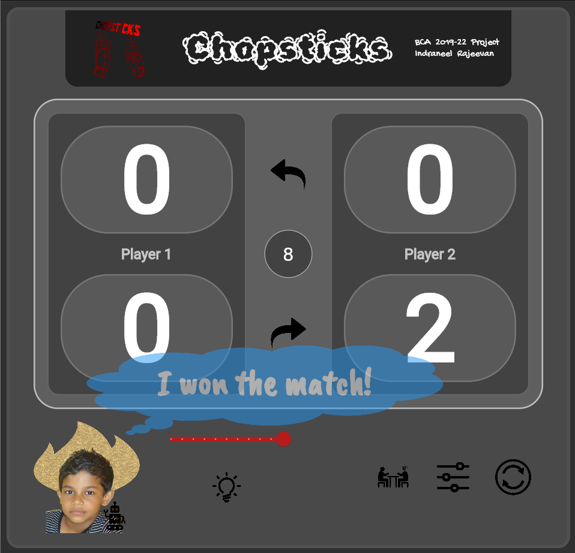

# Chopsticks Game (BCA 2019-22 Project)

An endeavor to provide a digital platform for people interested in
Chopsticks to play and/or improve their tactical skills.

- intuitive user interface
- play with/against my bot
- adjust bot levels
- undo
- redo
- hint
- restart
- bot analysis
- position picker
- static game analysis

## Version: 0.1.0

- Initial development release.

## License

<pre>
 Copyright 2022 Indraneel Rajeevan
 
 Redistribution and use in source and binary forms, with or without
 modification, are permitted provided that the following conditions are
 met:
     1. Redistributions of source code must retain the above copyright
        notice, this list of conditions and the following disclaimer.
     2. Redistributions in binary form must reproduce the above
        copyright notice, this list of conditions and the following
        disclaimer in the documentation and/or other materials provided
        with the distribution.
     3. Neither the name of the copyright holder nor the names of its
        contributors may be used to endorse or promote products derived
        from this software without specific prior written permission.
 
 THIS SOFTWARE IS PROVIDED BY THE COPYRIGHT HOLDERS AND CONTRIBUTORS
 "AS IS" AND ANY EXPRESS OR IMPLIED WARRANTIES, INCLUDING, BUT NOT
 LIMITED TO, THE IMPLIED WARRANTIES OF MERCHANTABILITY AND FITNESS FOR
 A PARTICULAR PURPOSE ARE DISCLAIMED. IN NO EVENT SHALL THE COPYRIGHT
 OWNER OR CONTRIBUTORS BE LIABLE FOR ANY DIRECT, INDIRECT, INCIDENTAL,
 SPECIAL, EXEMPLARY, OR CONSEQUENTIAL DAMAGES (INCLUDING, BUT NOT
 LIMITED TO, PROCUREMENT OF SUBSTITUTE GOODS OR SERVICES; LOSS OF USE,
 DATA, OR PROFITS; OR BUSINESS INTERRUPTION) HOWEVER CAUSED AND ON ANY
 THEORY OF LIABILITY, WHETHER IN CONTRACT, STRICT LIABILITY, OR TORT
 (INCLUDING NEGLIGENCE OR OTHERWISE) ARISING IN ANY WAY OUT OF THE USE
 OF THIS SOFTWARE, EVEN IF ADVISED OF THE POSSIBILITY OF SUCH DAMAGE.
</pre>

## Service

This repository primarily contains the output of `flutter build web` and
not the original source code that I have written in
Dart (alongside Flutter) and Python, as it is intended only for deployment
(at least until I complete my course) in order to avoid instances/illusions of
plagiarism and hindrance to my degree certificate.

- **Game**

  <https://indraneel12.github.io/chopsticks/>

- **Analysis**

  <https://indraneel12.github.io/chopsticks/indrubot-analysis/>

The core goal (apropos porting this relatively unpopular game to a
digital platform) has been accomplished, wherein marketing, business, and
suchlike have not been a priority, as I view this project more
along the lines of a stepping stone towards enhancing my
software engineering calibre.

## Notice

> This project is not endorsed by or affiliated with any of its dependencies
> (including, but not limited to, Google LLC), solely fulfilling the requirement
> of an end semester project by Kannur University under the course BCA,
> during the academic period 2019-22, in the matter of Indraneel Rajeevan.
